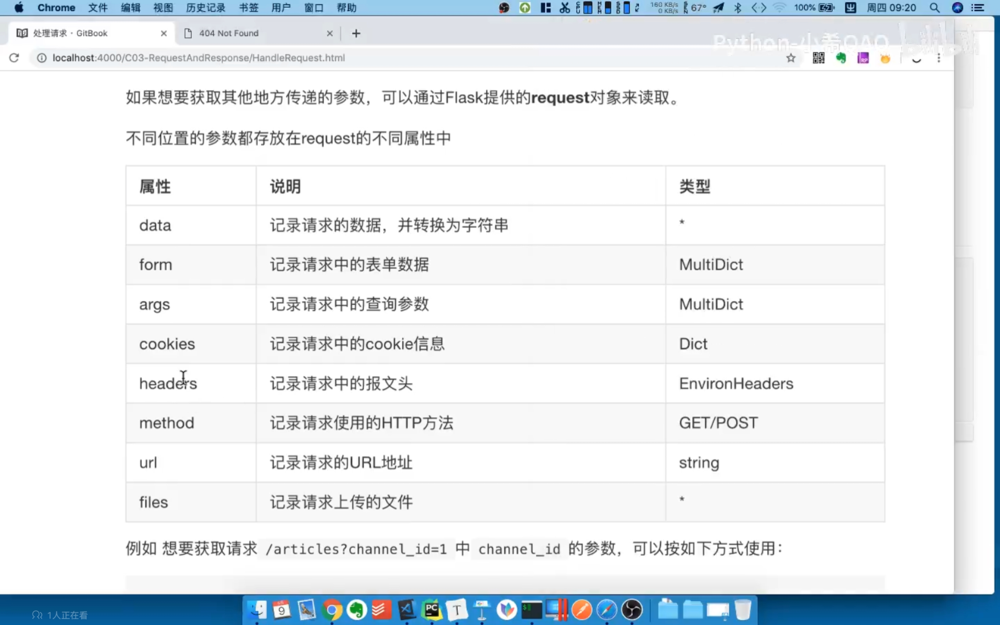
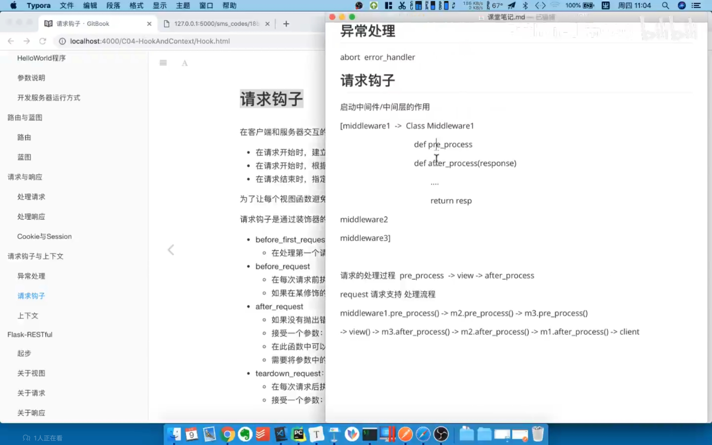
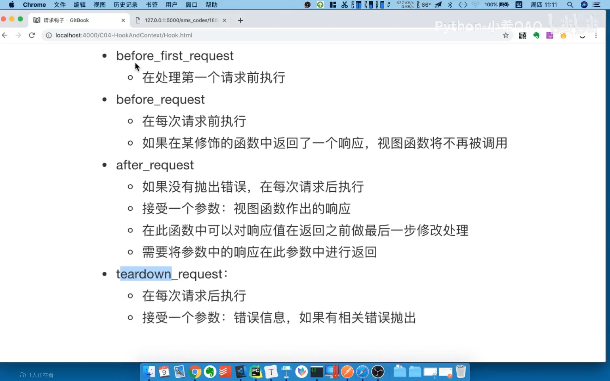

# Flask学习笔记

## 一、Flask工程搭建和配置

### 1.1flask的hello world

可以直接创建例如helloworld.py文件一样的一个普通的python文件

```python
from flask import Flask

app = Flask(__name__)


@app.route('/')
def hello_world():  # put application's code here
    return 'Hello World!'


if __name__ == '__main__':
    app.run()
```

启动运行：

```
python helloworld.py
```

### 1.2参数说明

1. Flask对象初始化参数

   ```
   1.import_name Flask所在的包，传__name__就可以
   2.static_url_path 静态文件访问路径，可以不传，默认为：/+static_folder
   3.static_folder  默认为static
   4.templates_folder  默认为templates
   ```

   

2. 应用程序配置参数

   Flask所有的配置信息都保存在app.config属性里面，该属性可以按照字典方式进行操作
   读取：

    * app.config.get(name)
    * app.config[name]

   设置：

   * 从配置对象中加载

     app.config.from_object(配置对象)

     ```python
     class DefaultConfig(object):  #配置写在类中
         """默认配置"""
         SECRET_KEY='sdadada'
     app = Flask(__name__)
     app.config.from_object(DefaultConfig)
     ```

   * 从配置文件中加载

     新建一个setting.py

     ```python
     SECRT_KEY='dasasdasdas'
     ```

     在Flask文件中：

     ```python
     app=Flask(__name__)
     app.config.from_pyfile('setting.py')
     ```

   * 从环境变量中加载

     ```python
     app.config.from_envvar('环境变量名',silent=True)
     # 环境变量的值为一个配置文件
     ```

     

3. app.run()运行参数

> host   运行ip    port  运行端口 app.run(host="",port=,deBug=True)

直接运行Flask项目：

```
flask run
环境变量 FLASK_APP 指明flask启动实例
flask run -h 0.0.0.0 -p 8000 指定主机和端口运行
flask run --help 获取帮助
环境变量FLASK_ENV决定生产模式和开发模式
development
production
```


## 二、路由和蓝图

### 2.1查询路由

使用命令直接查询当前app所有路由

```cmd
flask routes
```

在代码中查找路由

```python
app = Flask(__name__)
print(app.url_map)
```

使用例子

构造获取全部路由信息的接口：

```python
#需求，需要遍历一个url_map  取出特定信息 在一个特定的接口返回


```

### 2.2flask请求方式

1. GET
2. OPTION（自带） 简化版的GET请求 用于询问服务器接口信息的
3. HEAD（自带） 简化版GET请求 只返回响应头不返回响应体

以上三种为默认支持的请求方式

自定请求方式使用methods参数

```python
@app.route("/",methods=["POST","GET"])
```


 ### 2.3蓝图的定义使用

在Flask当中使用蓝图来对模块进行组织管理，可以视为存储一组视图方法的容器对象

每一个蓝图有自己的模板静态文件可以独立定义url前缀

在初始化一个应用时，就应该注册需要使用的蓝图

使用蓝图的三个步骤：

1. 创建一个蓝图对象

   ```python
   user_bp=Blueprint('user',__name__)# 相当于app=Flask(__name__)参数也一样 没有默认的static了
   ```

   

2. 在这个蓝图对象上进行操作，注册路由，指定静态文件夹，注册模板过滤器

   ```python
   @user_bp.router('/')
   def user_profile(): 
       return 'user_profile'
   ```

   

3. 在应用对象上注册这个蓝图

   ```python
   app.register_blueprint(user_bp,url_prefix="/user") #加url前缀
   ```

在目录中创建蓝图

新建一个目录

在init中

```python
from flask import Blueprint

good_bp=Blueprint('goods',__name__)

from . import views
```

新建views.py文件

```python
from . import goods_bp

@goods_bp.route('goods')
def get_goods():
    return 'get goods'
```

在app文件中

```python
import goods import goods_bp
app.register_blueprint(goods_bp)
```


## 三、请求和响应

### 3.1处理请求

```http
请求报文
GET（请求方式） /path？a=1 HTTP1.1  路径和后面字符串
content-Type: application/json    请求头
...
body -> file form json xml
```

1. url后传参接受方式（使用转化器）

```python

```

2. request对象的使用

request的属性：



获取询问参数示例：

```python
# Flask提供全局对象
from Flask import request

# /articles?channel_id=123  ?后面为查询参数
@app.route("/articlse")
def get_articles():
    channel_id = request.args.get('channel_id')
    return 'you wanna articles of channel {}'.format(channel_id)

```

上传图片示例：

```python
@app.route('/upload', methods=['POST'])
def upload_file():
    f = request.files['pic']
    with open('./demo.png','wb') as new_file:
        new_file.write(f.read())
    # 或者使用 f.save('/demo.png')
    return 'ok'
```

### 3.2处理响应

```http
响应报文格式：
HTTP/1.1 200 OK
Content-Type：application/json
。。。
body
```

1. 模板响应 使用 return rend_template()  （后续需要时再学）
2. 重定向  return  redirect(‘url’)（链接到别的页面需要时学习）
3. 返回JSON

```python
from flask import jsonify
@app.route('/demo3')
def demo3():
    json_dict ={
        "user_id": 10,
        "user_name": "laowang",
    }
    return jsonify(json_dict)


#方法二：
import json
return json.dump({
    
})

方法一：转化成json格式字符串 设置了响应头 application/json
方法二：仅仅设置json格式字符串
```

4. 自定义状态码和响应头

   * 元组方式  return  response，status，headers

   ```python
   @app.route('/demo4')
   def demo4():
       return '状态码为666'，666，{'Itcast':'Python'}
   ```

   

   * make_response方式

   ```python
   @app.route('/demo4')
   def demo4():
       resp=make_response('make reponse测试')
      		resp.headers["Itcast"]="python"
           resp.status="404 not found"
       return resp
   ```

   

### 3.3Cookie和Session

#### 1.Cookie

Cookie是呗设置在响应头中的键值对

```python
设置 #resp为make_response设置的响应体格式
resp.set_cookie('username','itcast')
resp.set_cookie('username','itcast',max_age=3600) #生存周期 秒
获取
resp=request.cookies.get('username')
删除
respons.delete_cookie('username')
```


#### 2.Session

flask中的Sesssion存储在浏览器缓存，因为存储在浏览器不安全需要设置密钥

```python
使用是像字典一样
session['username']='itcast'
username=session.get('username')


设置密钥SECRT_KEY   
SECRT_KEY='dsadaffasdfasd'
使用上面的设置环境变量的方式设置均可
```


## 四、请求钩子和上下文

### 4.1异常处理

1. HTTP异常主动抛出

* abort方法

```python

```


2. 捕获错误

### 4.2请求钩子

中间件的说明（所有的views函数都需要遵循的处理流程）



请求钩子的使用：

```
请求钩子
befor_first_request   只在第一个请求前执行
befor_request
after_request     没有未处理异常时执行
teardown_request  每次请求后执行
```




```python
@app.befor_first_request
def fun():
    return 
以上为定义钩子函数示例  所有钩子函数定义均相似
```


### 4.3上下文


