# 深度学习笔记

## 一、深度学习要解决的问题

### 1.1机器学习流程

1. 数据获取
2. 特征工程（机器学习中最核心的一部分）
3. 建立模型
4. 评估与应用

### 1.2特征工程的作用

- 数据特征决定了模型的上限
- 预处理和特征提取是最核心的
- 算法与参数选择决定了如何逼近这个上限
- 机器学习是人工决定特征的提取实现数学公式，深度学习智能的实现特征提取

### 1.3深度学习解决的核心问题

> 机器可以智能的选择合适的特征并提取特征

## 二、深度学习的应用

> 1.计算机视觉（输入数据属于图片）
>
> - 人脸识别
> - 医学诊断
>
> 2.NLP（输入数据属于文本）
>
> 3.传统数据挖掘（使用较少） 90%应用于计算机视觉和NLP

缺点（计算量太大，移动端适配不好）

需要计算千万级别的参数

## 三、图像分类

### 3.1机器学习常规套路

1. 收集数据并给定标签
2. 训练一个分类器
3. 测试、评估

### 3.2传统算法解决计算机视觉问题

#### 3.2.1K近邻算法

> K近邻算法流程：
> 
> 1. 计算已知类别数据集中的点与当前点的距离
> 2. 按照距离依次排序
> 3. 选取当前点距离最小的K个点
> 4. 确定前K个点所在类别的出现概率
> 5. 返回前K个点出现频率最高的类别作为当前点预测分类

解决图像问题过程：

1. 图像距离计算方式

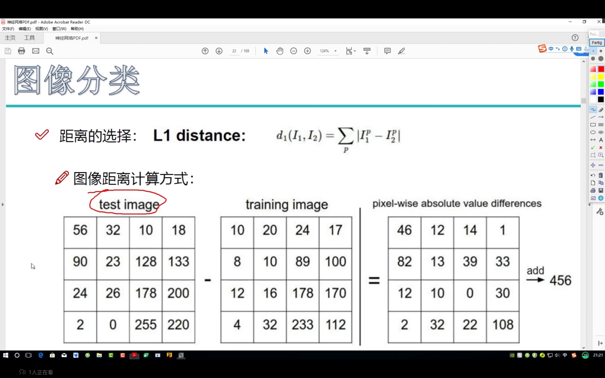

2. 得到结果

> 得到结果不好，背景主导是一个很大的问题我们关注的是主体，

如何才能让机器学习到哪些是重要的成分呢？

使用神经网络

## 四、神经网络基础

### 4.1得分函数

计算该这个图片是什么种类的得分

图片————————>每个类别的的分布    f(x,W)  计算得到一个列向量得出每个类别的得分

> f（x，W）=W*x+b
>
> x:特征      W：权重参数 对每个特征和 权重参数写成向量算內积  W为权重参数 b为偏置参数
>
> W：10*像素点个数   10表示十个类别
>
> x：像素点个数*1
>
> b：10*1

计算方法如下图：

（下图是一种三分类算法，每行代表一个种类的占比权重）

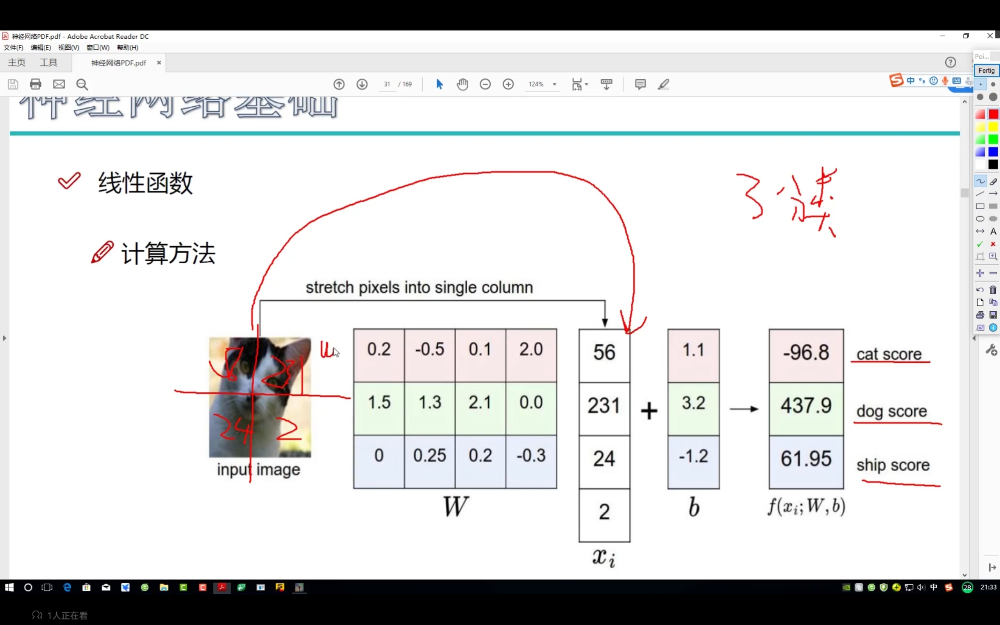

### 4.2损失函数

用于判断和真实的差别，（做不同的任务就是损失函数不同）

公式为，属于其他类别的权重减去他为正确类别的值加一个derta（为允许的误差范围在derta内视作没有损失，，0就表示没有损失），这就是损失度（错误越离谱数值越大）
$$
L=1/N\sum_{i=1}^{n}max(0,f(x_i;W)_j-f(x_i;W)_0+derta)+\lambda R(W)
$$

上面公式最后一项就是防止过拟合化，系数越大越不会过拟合。

过拟合的情况：

在训练时过分的关注于局部，下图展示过拟合情况，模型A就是过拟合的情况:

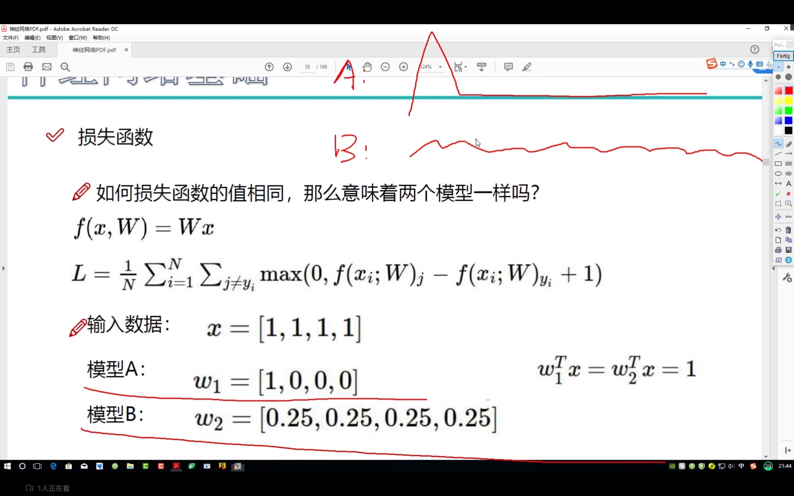

> derta为容忍度，即正确的判断的分数至少要比错误判断高出的值
>
> R（W）为正则化惩罚  （防止过拟合化）(神经网络太强大了一定要防止过拟合化)

$$
R(W)=\sum_k\sum_lW_k^2
$$

 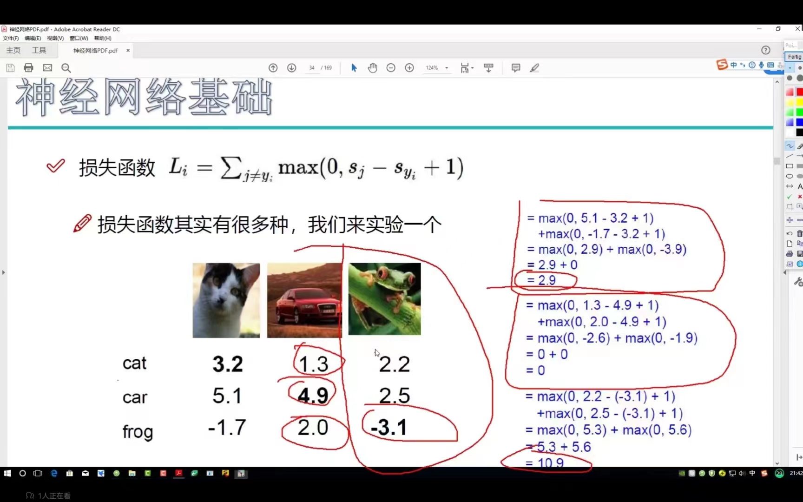

### 4.3Softmax分类器

得分函数计算完毕后进行的非线性转化

> 得分函数计算出后--->exp 方法得分差别----->归一化算概率------>使用log函数计算损失值（最后一步只关心正确类型）

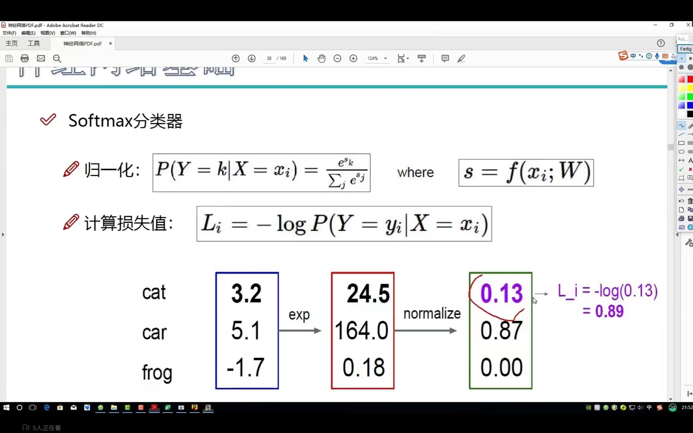

前向传播过程：

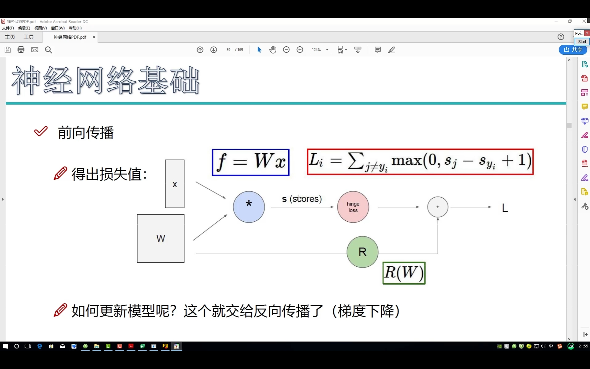

### 4.4反向传播过程

返向传播的过程是一次一次逐层求偏导，链式法则得出每个参数对结果的影响从而改变数值

求偏导过程;

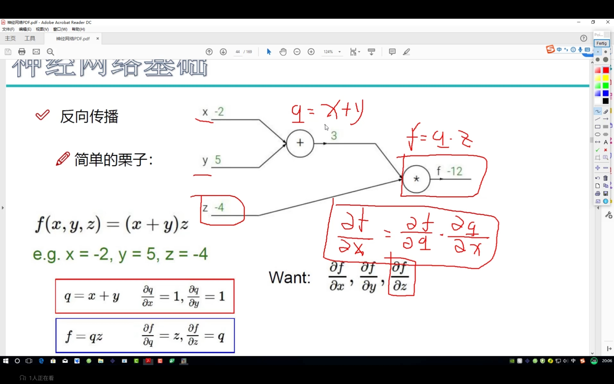

常见的梯度传递有以下几种

加法：均匀传递

乘法：互换传递

MAX函数，只给大个传递其他为0

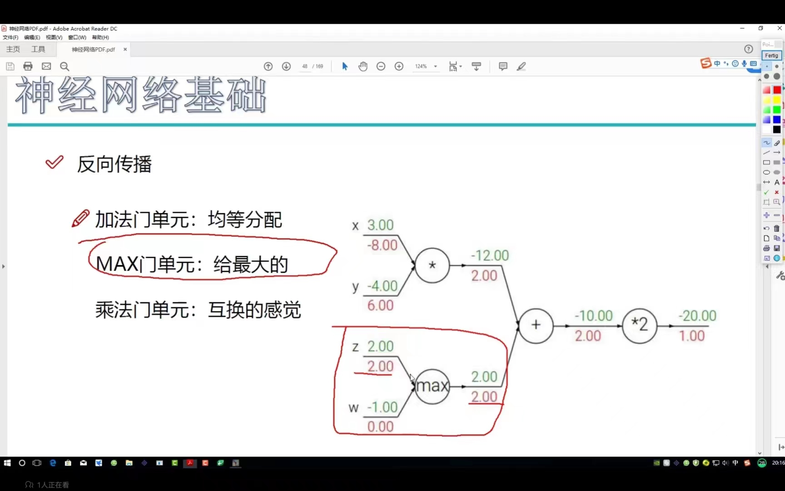

### 4.5神经网络整体架构

神经网络的基本结构：

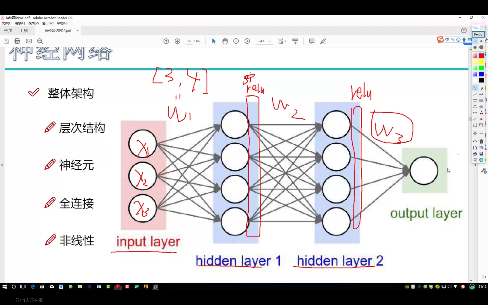

惩戒力度的影响：

惩戒力度越大会使得曲线越没有弯曲，惩戒力度不易过大，惩戒力度太小也不利于实际算法测试的准确度

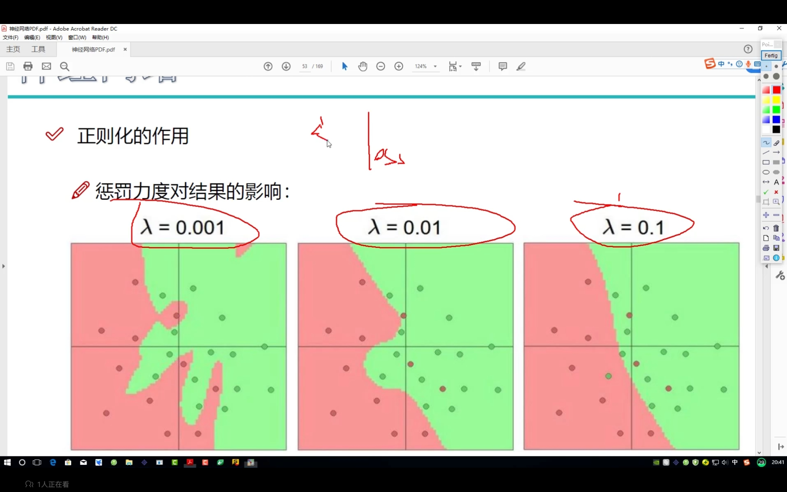

激活函数是一种非线性函数，用于每次隐层计算后对数据的非线性处理。

激活函数对比;

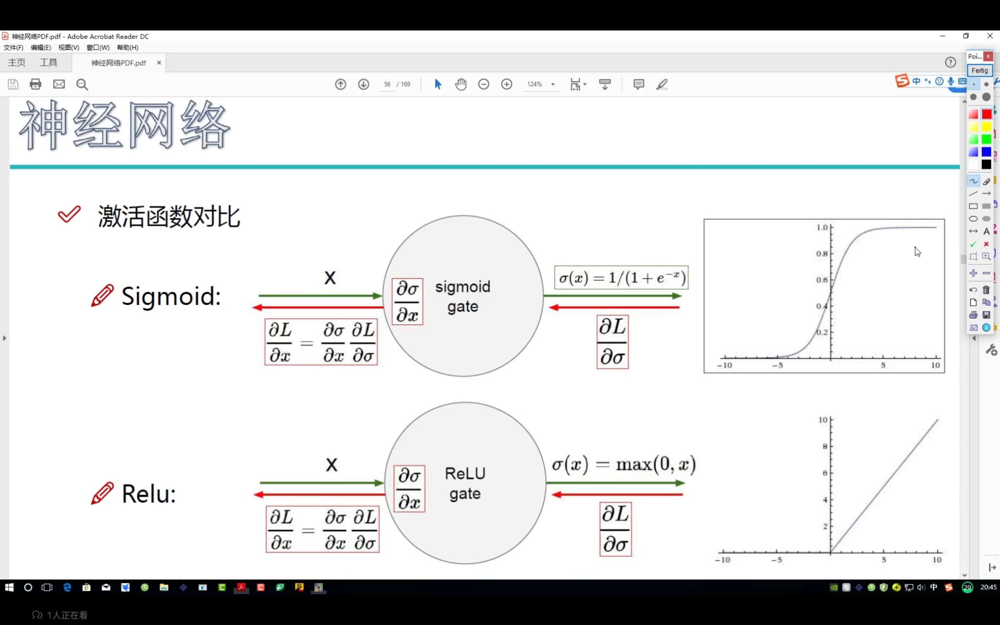

数据输入前要进行标准化预处理

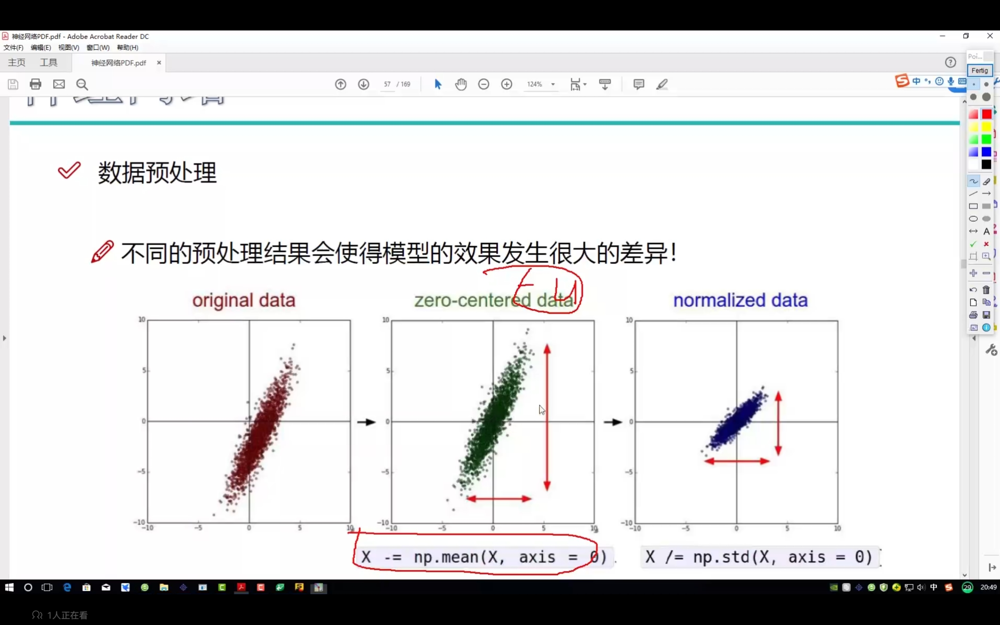

矩阵参数初始化不易使参数过大，一般的参数初始化如下;

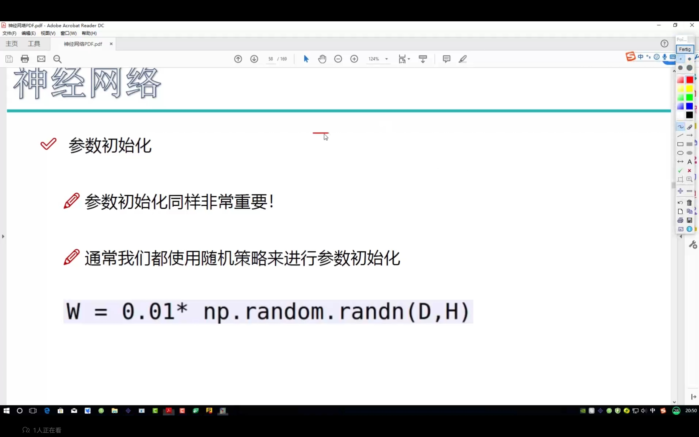

一种常用的预防过拟合化的方法（七伤拳）:

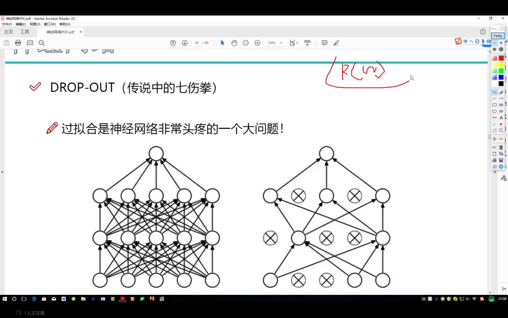

## 五、卷积神经网络

